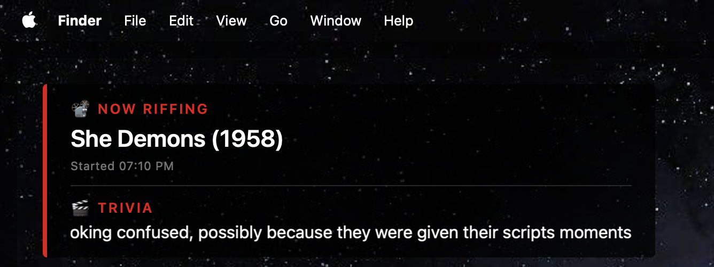

# RiffTrax Twitch Notifier

A lightweight, locally-running bot that watches the [RiffTrax Twitch channel](https://www.twitch.tv/rifftrax) chat for the command that announces a new movie or short starting, then fires a **macOS system notification** and updates an optional **desktop widget** with the title.

No Twitch account, API keys, or OAuth tokens required.

---



## Features

- Connects anonymously to Twitch IRC — no credentials needed
- Fires a native macOS notification with the movie/short title
- Optional [Übersicht](https://tracesof.net/uebersicht/) desktop widget that shows what's currently playing
- Auto-reconnects if the connection drops
- All chat messages printed to the terminal for visibility

---

## Requirements

- macOS (notifications use `osascript`)
- Python 3.10+
- [Übersicht](https://tracesof.net/uebersicht/) *(optional, for desktop widgets)*
- An [Anthropic API key](https://console.anthropic.com/) *(optional, for the trivia widget)*

---

## Installation

```bash
git clone https://github.com/RyanRatcliff/rifftrax_twitch_announce.git
cd rifftrax_twitch_announce
```

For the trivia widget only, install the `anthropic` SDK (a virtual environment is recommended):

```bash
python3 -m venv .venv
source .venv/bin/activate
pip install -r requirements.txt
```

---

## Usage

### Start the bot

```bash
python3 bot.py
```

Press `Ctrl+C` to stop.

By default only bot events are printed. Pass `--chat` to also print all Twitch chat messages:

```bash
python3 bot.py --chat
```

When the trigger command is detected, a macOS notification will pop up and `~/.rifftrax_now_playing.txt` will be updated with the current title.

---

## Running as a background service (macOS)

A `Makefile` is included that manages the bot as a [launchd](https://support.apple.com/guide/terminal/script-management-with-launchd-apdc6c1077b-5d5d-4d35-9c19-60f2397b2369/mac) agent — macOS's native service manager. The service auto-restarts if it crashes and starts automatically on login after install.

```bash
make install    # write the launchd plist, start the service, and enable auto-start on login
make stop       # stop the service
make start      # start it again
make restart    # stop then start
make uninstall  # stop and remove the plist entirely
make logs       # follow the bot log in real time (Ctrl+C to exit)
make status     # show whether the service is running
```

Logs are written to `~/.rifftrax_bot.log` and errors to `~/.rifftrax_bot_error.log`.

> **Note:** The service runs `bot.py` without `--chat`, so Twitch chat is not logged. To enable chat logging, open the `Makefile`, find the `ProgramArguments` section in `PLIST_XML`, and add `<string>--chat</string>` after the `bot.py` line, then run `make restart`.

---

## Desktop Widget (optional)

An [Übersicht](https://tracesof.net/uebersicht/) widget is included that shows the current movie title, start time, and a scrolling trivia ticker in a single overlay card. Each section hides itself independently when its data isn't available, and the whole card hides when nothing is playing.

### Setup

1. Copy the widget:

```bash
cp -r widget/rifftrax-combined.widget ~/Library/Application\ Support/Übersicht/widgets/
```

2. For trivia, create an Anthropic API key file (one line, just the key):

```bash
echo "your-anthropic-api-key" > ~/.rifftrax_anthropic_key
chmod 600 ~/.rifftrax_anthropic_key
```

The bot detects the key file on startup and runs the trivia watcher automatically — no second process needed. When the title changes it calls Claude and writes trivia to `~/.rifftrax_trivia.txt`, which the widget picks up automatically. If no key file is found, trivia is silently skipped.

> **Note:** Each title change makes one API call to Claude Haiku. Costs are small but real — check your [Anthropic usage dashboard](https://console.anthropic.com/) if you're watching for long sessions.

To test without waiting for a stream:

```bash
echo "Plan 9 from Outer Space" > ~/.rifftrax_now_playing.txt
```

To clear it:

```bash
rm ~/.rifftrax_now_playing.txt
```

> **Note:** If your Übersicht widgets directory is not the default, substitute your actual path in the `cp` command above.

---

## Configuration

Edit the config block at the top of `bot.py`:

```python
CHANNEL            = "rifftrax"                        # Twitch channel to watch
TRIGGERS           = ("!cmd edit movie", "!cmd edit !movie")  # Commands that signal a new movie
RIFFTRAX_URL_MARKER = "rifftrax.com/"                 # Substring present in StreamElements movie replies
NICK               = "justinfan70"                    # Any justinfan* username works for anonymous access
```

> **Note:** The `justinfan` prefix is required by Twitch for anonymous read-only IRC connections. You can change the number but must keep the `justinfan` prefix.

---

## How It Works

Twitch chat is accessible over standard IRC. This bot connects anonymously using Twitch's `justinfan` protocol, joins the channel, and watches for a specific command posted by stream admins when a new title starts. When matched, it extracts the movie/short title from the message and triggers a macOS notification via `osascript`.

---

## Contributing

PRs welcome! Some ideas for extensions:

- Support for other streaming platforms
- Linux notification support (`notify-send`)
- A menu bar app alternative to the Übersicht widget
- Logging history of what's been played
